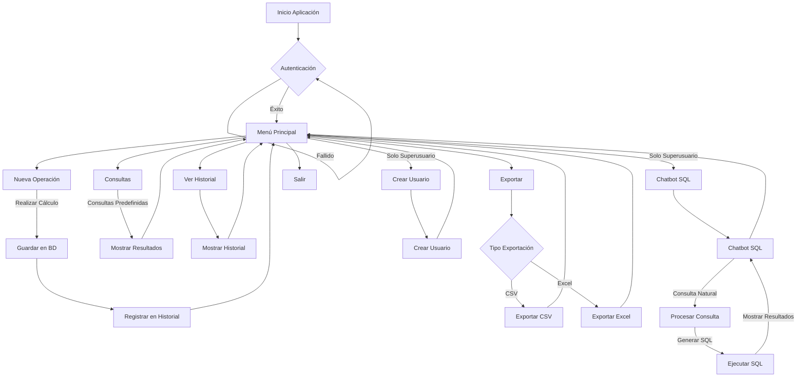

# Calculadora Avanzada

Un sistema avanzado de calculadora con autenticación de usuarios, operaciones matemáticas, registro de historial, exportación de datos y capacidades de consulta mediante un chatbot SQL.

## Características Principales

- **Sistema de autenticación**: Usuarios normales y superusuarios
- **Operaciones matemáticas avanzadas**: Suma, resta, multiplicación, división, potencias y raíz cuadrada
- **Registro de historial**: Almacenamiento persistente de operaciones y acciones
- **Exportación de datos**: Exportación de resultados a CSV y Excel
- **Chatbot SQL**: Interfaz de consulta en lenguaje natural (solo superusuarios)
- **Seguridad**: Contraseñas hasheadas y validación de consultas SQL

## Estructura del Proyecto

```
calculadora/
│
├── core/                       # Funcionalidades básicas
│   ├── __init__.py
│   ├── export_utils.py         # Utilidades de exportación
│   ├── operators.py            # Operadores matemáticos
│   └── utils.py                # Utilidades generales
│
├── db/                         # Capa de datos
│   ├── __init__.py
│   ├── connection.py           # Conexión a la base de datos
│   └── models.py               # Modelos y operaciones de BD
│
├── services/                   # Servicios de la aplicación
│   ├── __init__.py
│   ├── operation_service.py    # Servicio de operaciones
│   └── user_service.py         # Servicio de usuarios
│
├── __init__.py
├── cli_app.py                  # Aplicación de línea de comandos
├── consultas.py                # Consultas predefinidas
├── sql_chatbot.py              # Chatbot SQL con IA
│
├── venv/                       # Entorno virtual (no incluido en repo)
├── .env                        # Variables de entorno (no incluido en repo)
├── .gitignore                  # Archivos ignorados por git
├── main.py                     # Punto de entrada principal
├── query_cache.json            # Caché de consultas del chatbot
├── README.md                   # Documentación
└── requirements.txt            # Dependencias del proyecto
```

## Diagrama de Flujo



## Arquitectura MVC del Chatbot SQL

El chatbot SQL implementa una arquitectura Modelo-Vista-Controlador:

- **Modelo**: Representado por las operaciones de base de datos en `db/models.py`
- **Vista**: Implementada en la interfaz de línea de comandos en `cli_app.py`
- **Controlador**: Lógica principal en `sql_chatbot.py` que conecta las consultas en lenguaje natural con las operaciones de base de datos

## Requisitos Previos

- Python 3.8+
- PostgreSQL 12+
- Cuenta en Groq (para el chatbot SQL)

## Instalación

1. Clonar el repositorio:
   ```bash
   git clone https://github.com/username/calculadora-avanzada.git
   cd calculadora-avanzada
   ```

2. Crear y activar entorno virtual:
   ```bash
   # En Windows
   python -m venv venv
   venv\Scripts\activate
   
   # En Linux/Mac
   python -m venv venv
   source venv/bin/activate
   ```

3. Instalar dependencias:
   ```bash
   pip install -r requirements.txt
   ```

4. Configurar la base de datos PostgreSQL:
   - Crear una base de datos llamada `calculadora`
   - Configurar las credenciales en el archivo `.env`

5. Configurar variables de entorno:
   - Copiar el archivo `.env.example` a `.env`
   - Actualizar las variables con tus credenciales:
   
   ```
   # Variables para PostgreSQL
   POSTGRES_DB=calculadora
   POSTGRES_USER=tu_usuario
   POSTGRES_PASSWORD=tu_contraseña
   POSTGRES_HOST=localhost
   POSTGRES_PORT=5432
   
   # API Key para Groq (necesario para el chatbot SQL)
   GROQ_API_KEY=tu_api_key_de_groq
   ```

## Uso

### Iniciar la aplicación

```bash
python main.py
```

### Autenticación

Al iniciar la aplicación, se presentará un menú de autenticación:
1. Registrarse
2. Iniciar Sesión
3. Salir

#### Requisitos de contraseña:
- Al menos 8 caracteres
- Al menos 1 mayúscula
- Al menos 1 caracter especial

### Menú Principal

Una vez autenticado, tendrás acceso al menú principal:

1. **Realizar Nueva Operación**
   - Permite realizar operaciones matemáticas: +, -, *, /, ^, sqrt
   - Los resultados se guardan automáticamente

2. **Consultas**
   - Ver operaciones realizadas
   - Filtrar por operador
   - Consultas avanzadas (superusuario)

3. **Ver Historial**
   - Acceso al historial de operaciones de las últimas 24 horas
   - Superusuarios pueden ver el historial de todos los usuarios

4. **Exportar Operaciones**
   - Exportar a formato CSV o Excel
   - Superusuarios pueden exportar todas las operaciones

5. **Crear Usuario** (solo superusuarios)
   - Crear usuarios normales o superusuarios

6. **Chatbot SQL** (solo superusuarios)
   - Realizar consultas en lenguaje natural sobre la base de datos
   - Ver SQL generado
   - Exportar resultados

### Chatbot SQL

Ejemplos de consultas para el chatbot:
- "¿Cuántas operaciones ha realizado el usuario admin?"
- "¿Cuál es el promedio de los resultados de sumas?"
- "Muéstrame las últimas 5 operaciones de todos los usuarios"
- "¿Quién ha usado más la raíz cuadrada?"
- "Exportar las operaciones del usuario admin"

Comandos especiales:
- `!nivel [basico/medio/avanzado]`: Cambia el nivel técnico de las respuestas
- `!feedback [corrección]`: Proporciona retroalimentación sobre la última respuesta
- `!cache`: Limpia el caché de consultas
- `!sql [consulta]`: Muestra el SQL generado para una consulta sin ejecutarla
- `!salir`: Volver al menú principal

## Seguridad

- Contraseñas hasheadas con SHA-256 y salt
- Validación de consultas SQL para prevenir inyecciones
- Acceso limitado a funcionalidades críticas (solo superusuarios)
- Historial persistente con limpieza automática

## Desarrollo

### Añadir nuevos operadores

Para añadir un nuevo operador matemático, modifica el archivo `core/operators.py`:

```python
operators = {
    # ... operadores existentes
    'nuevo_op': lambda a, b: # lógica del operador
}
```

### Extender el chatbot SQL

Para mejorar las capacidades del chatbot SQL, puedes:
1. Modificar los prompts en `sql_chatbot.py`
2. Añadir nuevas validaciones en `SQLSecurityValidator`
3. Mejorar el sistema de caché en `QueryCache`

## Licencia

Este proyecto está licenciado bajo los términos de la licencia MIT.